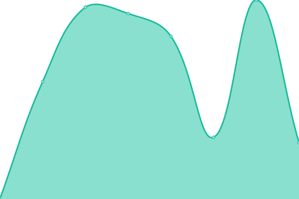
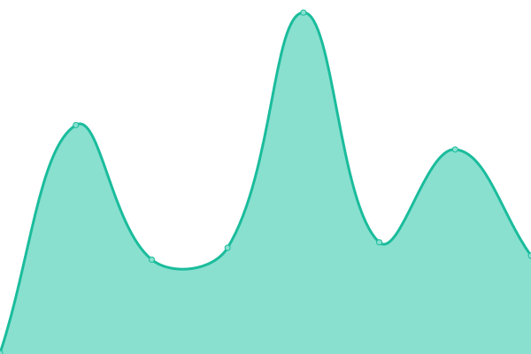
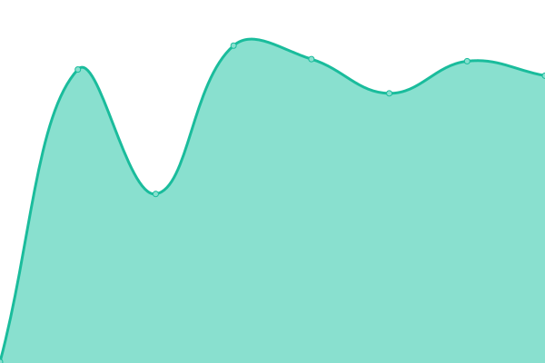
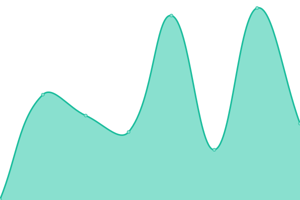
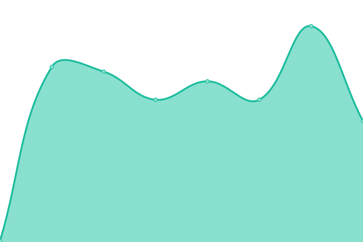

# [📈 Live Status](https://status.oradoo.com): <!--live status--> **🟩 All systems operational**

This repository contains the open-source uptime monitor and status page for [amcohrs-oradoo](https://status.oradoo.com), powered by [Upptime](https://github.com/upptime/upptime).

With [Upptime](https://upptime.js.org), you can get your own unlimited and free uptime monitor and status page, powered entirely by a GitHub repository. We use [Issues](https://github.com/amcohrs-oradoo/uptime/issues) as incident reports, [Actions](https://github.com/amcohrs-oradoo/uptime/actions) as uptime monitors, and [Pages](https://status.oradoo.com) for the status page.

<!--start: status pages-->
<!-- This summary is generated by Upptime (https://github.com/upptime/upptime) -->
<!-- Do not edit this manually, your changes will be overwritten -->
<!-- prettier-ignore -->
| URL | Status | History | Response Time | Uptime |
| --- | ------ | ------- | ------------- | ------ |
|  Pro Putt Systems | 🟩 Up | [pro-putt-systems.yml](https://github.com/amcohrs-oradoo/uptime/commits/HEAD/history/pro-putt-systems.yml) | 

 486ms
     
 | 

<a href="https://status.oradoo.com/history/pro-putt-systems">100.00%</a>
    

|  Carolina Custom Putting Greens | 🟩 Up | [carolina-custom-putting-greens.yml](https://github.com/amcohrs-oradoo/uptime/commits/HEAD/history/carolina-custom-putting-greens.yml) | 

 459ms
     
 | 

<a href="https://status.oradoo.com/history/carolina-custom-putting-greens">100.00%</a>
    

|  Pro Backyard | 🟩 Up | [pro-backyard.yml](https://github.com/amcohrs-oradoo/uptime/commits/HEAD/history/pro-backyard.yml) | 

 287ms
     
 | 

<a href="https://status.oradoo.com/history/pro-backyard">100.00%</a>
    

|  Turf Innovations | 🟩 Up | [turf-innovations.yml](https://github.com/amcohrs-oradoo/uptime/commits/HEAD/history/turf-innovations.yml) | 

 525ms
     
 | 

<a href="https://status.oradoo.com/history/turf-innovations">100.00%</a>
    

|  Loyal Toys | 🟩 Up | [loyal-toys.yml](https://github.com/amcohrs-oradoo/uptime/commits/HEAD/history/loyal-toys.yml) | 

 503ms
     
 | 

<a href="https://status.oradoo.com/history/loyal-toys">100.00%</a>
    

|  Pro Court Systems | 🟩 Up | [pro-court-systems.yml](https://github.com/amcohrs-oradoo/uptime/commits/HEAD/history/pro-court-systems.yml) | 

 166ms
     
 | 

<a href="https://status.oradoo.com/history/pro-court-systems">100.00%</a>
    

<!--end: status pages-->

[**Visit our status website →**](https://status.oradoo.com)

## 📄 License

- Powered by: [Upptime](https://github.com/upptime/upptime)
- Code: [MIT](./LICENSE) © [amcohrs-oradoo](https://status.oradoo.com)
- Data in the `./history` directory: [Open Database License](https://opendatacommons.org/licenses/odbl/1-0/)
